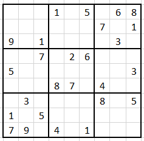

#SUDOKO - Classic

 

##Game Engine
Game-engineer
```
Logic to create a board based on complexity, starting with loading custom-made games from files.
```

Help-assistant
```
Logic to place symbols on the board, one by one, in order to show that algoritms are complete. 
```

Board-manager
```
Logic to handle all logic to assistants and engineers.
```

Rule-assistant
```
Logic to obey rules and serve explanations in text and speech.  
```

##Challenge-mode, time is mandatory
```
Be able to offer an Avatar profile, Country, State and City for the user in order to have any opponent.
Be able to share my game for opponents to use. 
```
* Avatar, Country, State, City
* Recorded/Online from real play, Computer simulation
* Same board, shadow moves on component

##Board Layout
```
Be able to choose colors or welLknown symbols
```

##Complexity
```
Be able to categorize complexity from number of possible values from start, number of possible board solutions.
Even offer a help mode
```

##Reuse of board-layout
```
Be able to reuse boards in order to create new ones by combining techniques like using 90 degree (turning the board), 
number replacement (replace 1 thru 9 into random e.g. 178354269) and flipping the board upside down - or a combination of the later.
```
